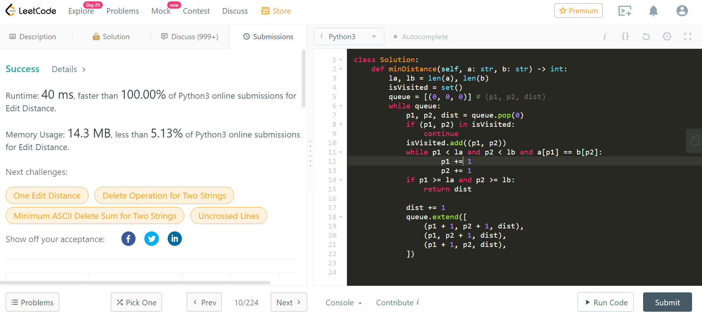

# [72. Edit Distance](https://leetcode.com/problems/edit-distance/)

## 解題思路

假設 `p1`, `p2` 為兩字串的位址指標，且起始為 0 ，若 `str1[p1] != str2[p2]`，需要取得以下動作的最小 `distance`:

1. 採用 `substitution`， `distance = 1 + lev(str1[p1+1:], str2[p2+1:])`
2. 採用 `insert` or `delete`，因此又再拆分成兩個動作
    - `distance = 1 + lev(str1[p1:], str2[p2+1:])`
    - `distance = 1 + lev(str1[p1+1:], str2[p2:])`

而 implement 有多種作法，目前個人實作的有:

1. 使用 `recursion`，並搭配 `memo` 做紀錄，避免解重複子問題，邏輯上與實作最為簡單
2. 建立 `2-D` DP Table，用 DP 思維解，需要初始 `base state`，在定義 update status 的邏輯即可
    - 註: 在 `golang` 得到最好成績，但有可能是 `FIFO-Queue` 的實作不夠好
3. 將子問題丟給 `FIFO-Queue`，並盡量更新每次子問題的步長，先走完的就可以提早 return，並且 skip 以解過的子問題
    - 註: 在 `Python` 得到最好成績

### 第一次在 `Python` 拿到 100%， 紀念一下

