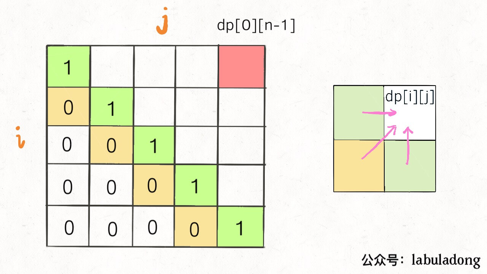

# [516. Longest Palindromic Subsequence](https://leetcode.com/problems/longest-palindromic-subsequence/)

## 解題思路

- 建立 2 維 dp Table，i 為左邊指針位置、j 為右邊指針位址，`dp[i][j]` 代表 `str[i:j+1]` 這段字串內最大的回文子字串長度。
- 目標為求得 `dp[0][-1]` 的結果，所以 table 歷遍方向為`由下至上`、`由左至右`
- **HINT**: 這題在 leetcode 上有 early return 的話 Runtime 會**大幅減少**。

[圖片來源](https://www.bookstack.cn/read/fucking-algorithm/%E5%8A%A8%E6%80%81%E8%A7%84%E5%88%92%E7%B3%BB%E5%88%97-%E5%AD%90%E5%BA%8F%E5%88%97%E9%97%AE%E9%A2%98%E6%A8%A1%E6%9D%BF.md#bgj4uu)

