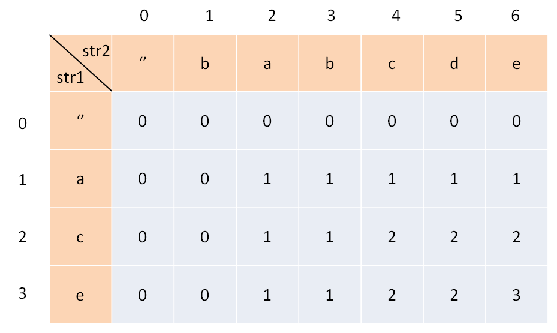

# [1143. Longest Common Subsequence](https://leetcode.com/problems/longest-common-subsequence/)

## 解題思路

建立 2 維的 DP table ([ref](https://labuladong.gitbook.io/algo/dong-tai-gui-hua-xi-lie/zui-chang-gong-gong-zi-xu-lie))

